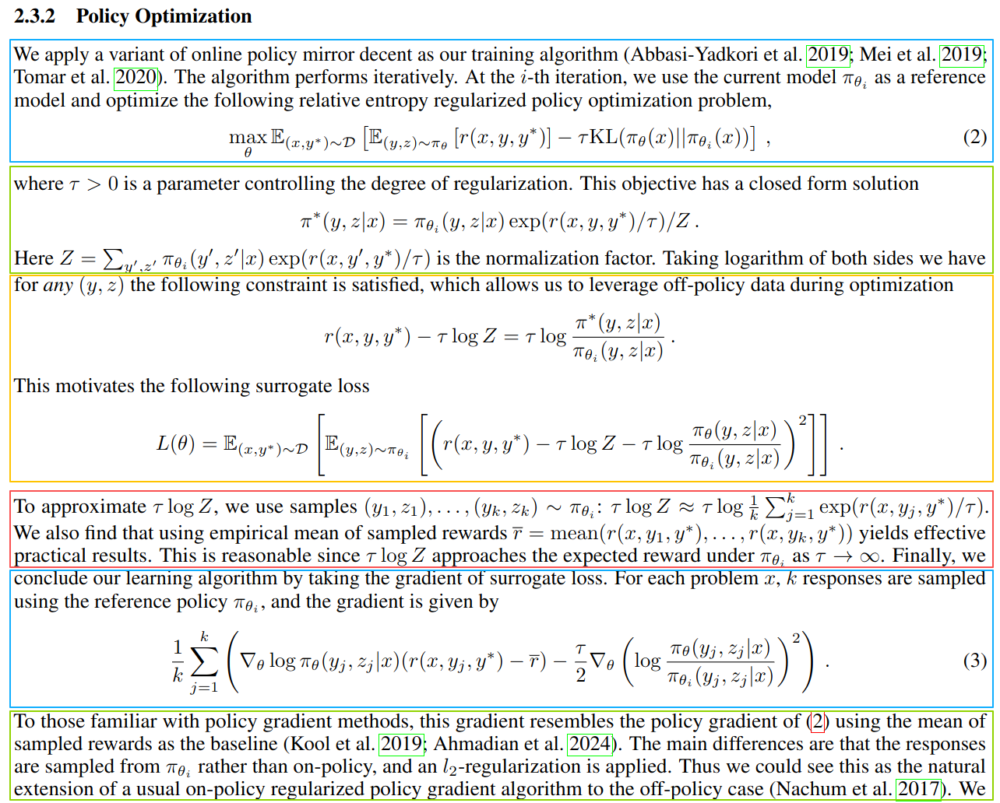

::: {.callout-tip appearance="simple"}
This note is mainly intended as a supplement to the mathematical derivation of the RL optimization part in the [Kimi K1.5 technical report](https://arxiv.org/abs/2501.12599), specifically Section 2.3.2. It is organized into six parts, with the analysis and derivation presented step by step.
:::

{fig-align="center" width="100%" fig-alt="Teaser image for the Kimi K1.5 technical report"}

## 1. Objective Function

Given a reference model $\pi_{\theta_i}$, the goal is to find a new model $\pi_\theta$ that maximizes the reward from the reward model. A KL term is included here, and $\tau$ controls the tradeoff between exploration and exploitation.

There are two expectations in the objective:

1. $\mathbb{E}_{x, y^*}$ means: on average, over a given question $x$ and its corresponding ground-truth answer $y^*$, ...

2. $\mathbb{E}_{(y, z)\sim \pi_\theta}$ means: on average, over the response $y$ and the long CoT $z$ sampled by the new model under the given question, ...

The objective can be interpreted as follows:

- On average, for a given question and its corresponding ground truth, the answer $y$ sampled by the new model should achieve as high a reward as possible under the reward model, while the new model should not deviate too much from the reference model.

## 2. Closed-Form Solution

The objective above has a closed-form solution. More precisely, it is $\pi_\theta$ that has a closed-form solution, not $\theta$ itself. The derivation uses the method of Lagrange multipliers.

First, we can ignore the outer expectation in the objective. In practice, we simply average the objective over the training dataset $\mathcal{D}$. The objective can therefore be simplified as:

$$
\max_{\theta}\ \mathbb{E}_{(y,z)\sim\pi_\theta}\big[r(x,y,y^*)\big]
-\tau\,\mathrm{KL}\big(\pi_\theta(x)\,\|\,\pi_{\theta_i}(x)\big)
$$

Here, the KL divergence is:

$$
\mathrm{KL}\big(\pi_\theta(x)\,\|\,\pi_{\theta_i}(x)\big)
=
\sum_{y,z}\pi_\theta(y,z\mid x)\log\frac{\pi_\theta(y,z\mid x)}{\pi_{\theta_i}(y,z\mid x)}
=
\mathbb{E}_{(y,z)\sim\pi_\theta}
\left[
\log\frac{\pi_\theta(y,z\mid x)}{\pi_{\theta_i}(y,z\mid x)}
\right]
$$

So the objective can be rewritten as:

$$
\max_{\theta}\ 
\mathbb{E}_{(y,z)\sim\pi_\theta}
\left[
r(x,y,y^*)-\tau\log\frac{\pi_\theta(y,z\mid x)}{\pi_{\theta_i}(y,z\mid x)}
\right]
$$

Next we construct the Lagrangian. The key point is to notice the following constraint:

$$
\sum_{y,z}\pi_\theta(y,z\mid x)=1
$$

That is, for a given question, if we enumerate all possible long CoT sequences $z$ together with all responses $y$, their probabilities must sum to 1.

Therefore, by the method of Lagrange multipliers, we combine the objective and the constraint into the following Lagrangian:

$$
\mathcal{L}(\pi_\theta,\lambda)
=
\sum_{y,z}\pi_\theta(y,z\mid x)
\left(
r(x,y,y^*)-\tau\log\frac{\pi_\theta(y,z\mid x)}{\pi_{\theta_i}(y,z\mid x)}
\right)
+
\lambda
\left(
1-\sum_{y,z}\pi_\theta(y,z\mid x)
\right)
$$

To solve the problem, we differentiate the Lagrangian with respect to $\pi_\theta$ and set the derivative to zero.

There is one subtle point here. When we talk about $\pi_\theta$, it is tied to one specific pair $(y_0,z_0)$. So when taking the derivative, among the sum over all $(y,z)$, we only care about the term where $(y,z)=(y_0,z_0)$. The derivatives of all other terms are zero. Therefore,

$$
\frac{\partial \mathcal{L}}{\partial \pi_\theta}
=
\left(
r-\tau\log\frac{\pi_\theta}{\pi_{\theta_i}}
\right)
+
\pi_\theta\left(-\frac{\tau}{\pi_\theta}\right)
-\lambda
=
r-\tau\log\frac{\pi_\theta}{\pi_{\theta_i}}-\tau-\lambda
$$

Setting the derivative to zero, that is,

$$
\frac{\partial \mathcal{L}}{\partial \pi_\theta}=0
$$

we obtain:

$$
r-\tau\log\frac{\pi_\theta}{\pi_{\theta_i}}-\tau-\lambda=0
$$

$$
\frac{r}{\tau}-\log\frac{\pi_\theta}{\pi_{\theta_i}}-1-\frac{\lambda}{\tau}=0
$$

$$
\log \pi_\theta
=
\frac{r}{\tau}+\log \pi_{\theta_i}-1-\frac{\lambda}{\tau}
$$

$$
\pi_\theta
=
\pi_{\theta_i}\cdot \exp(r/\tau)\cdot \exp(-1-\lambda/\tau)
$$

The last term above is a constant, so this can be written as:

$$
\pi_\theta
=
C\cdot \pi_{\theta_i}\cdot \exp(r/\tau)
$$

At this point, we already have the approximate form of the solution for $\pi_\theta$, except that we do not yet know the constant $C$. But from the normalization constraint that probabilities must sum to 1, we have:

$$
\sum_{y',z'} C\cdot \pi_{\theta_i}\cdot \exp(r/\tau)=1
$$

so

$$
C
=
\frac{1}{\sum_{y',z'}\pi_{\theta_i}\cdot \exp(r/\tau)}
$$

Putting everything together, we obtain:

$$
\pi_\theta
=
\frac{\pi_{\theta_i}\cdot \exp(r/\tau)}
{\sum_{y',z'}\pi_{\theta_i}\cdot \exp(r/\tau)}
$$

Returning to the full notation, this becomes:

$$
\pi_\theta(y,z\mid x)
=
\frac{
\pi_{\theta_i}(y,z\mid x)\cdot \exp\big(r(x,y,y^*)/\tau\big)
}{
\sum_{y',z'}\pi_{\theta_i}(y',z'\mid x)\cdot \exp\big(r(x,y',y^*)/\tau\big)
}
=
\pi_{\theta_i}(y,z\mid x)\cdot \exp\big(r(x,y,y^*)/\tau\big)/Z
$$

So we recover exactly the same formula as in the original paper.

## 3. Surrogate Loss

Since the optimal policy has a closed-form expression, we can use that identity to construct a surrogate objective. Concretely, we move all terms to one side, square the residual, and define a new objective that minimizes the mean squared error:

$$
L(\theta)
=
\mathbb{E}_{(x,y^*)\sim\mathcal{D}}
\left[
\mathbb{E}_{(y,z)\sim\pi_{\theta_i}}
\left[
\left(
r(x,y,y^*)-\tau\log Z-\tau\log\frac{\pi_\theta(y,z\mid x)}{\pi_{\theta_i}(y,z\mid x)}
\right)^2
\right]
\right]
$$

## 4. Computing $\tau \log Z$ and Its Approximation

Originally, computing $Z$ requires summing over all possible $(y', z' \mid x)$. In practice, however, we simply sample $k$ candidate answers.

At the same time, we can show that the mean reward under the reward model, denoted by $\bar r$, is a good approximation to $\tau \log Z$, because:

$$
\tau \log Z \to \mathbb{E}_{(y,z)\sim\pi_{\theta_i}}[r(x,y,y^*)]
\qquad \text{as } \tau \to \infty
$$

The proof is based on Taylor expansion followed by taking the limit.

We start from:

$$
Z = \sum_{y',z'} \pi_{\theta_i}(y', z' \mid x)\,
\exp\!\left(\frac{r(x,y',y^*)}{\tau}\right)
$$

Now notice that when $\tau$ goes to infinity,

$$
\exp\!\left(\frac{r}{\tau}\right) \approx 1 + \frac{r}{\tau}
$$

This comes from the Taylor expansion of $f(x)=e^x$ at $x=0$:

$$
e^x = 1 + x + \frac{x^2}{2!} + \frac{x^3}{3!} + \cdots
$$

so when $x$ is small, we have $e^x \approx 1+x$.

Therefore,

$$
Z \approx
\sum_{y',z'} \pi_{\theta_i}(y', z' \mid x)
\left(1 + \frac{r(x,y',y^*)}{\tau}\right)
=
1 + \frac{1}{\tau}
\sum_{y',z'} \pi_{\theta_i}(y', z' \mid x)\, r(x,y',y^*)
$$

Hence,

$$
\log Z
\approx
\log\left(
1 + \frac{1}{\tau}
\sum_{y',z'} \pi_{\theta_i}(y', z' \mid x)\, r(x,y',y^*)
\right)
$$

Next, consider the Taylor expansion of $f(x)=\log(1+x)$ at $x=0$:

$$
\log(1+x)=x-\frac{x^2}{2}+\frac{x^3}{3}-\frac{x^4}{4}+\cdots
$$

so when $x$ is small, we have $\log(1+x)\approx x$. Therefore,

$$
\log Z
\approx
\frac{1}{\tau}
\sum_{y',z'} \pi_{\theta_i}(y', z' \mid x)\, r(x,y',y^*)
$$

Multiplying both sides by $\tau$, we obtain

$$
\tau \log Z
\approx
\sum_{y',z'} \pi_{\theta_i}(y', z' \mid x)\, r(x,y',y^*)
=
\sum_{y,z} \pi_{\theta_i}(y, z \mid x)\, r(x,y,y^*)
=
\mathbb{E}_{(y,z)\sim\pi_{\theta_i}}[r(x,y,y^*)]
$$

So $\tau \log Z$ can be approximated by the expected reward under the reference policy, and in practice this is often further approximated by the empirical mean of sampled rewards.

## 5. Gradient Used for Optimization

The surrogate loss derived above is:

$$
L(\theta)
=
\mathbb{E}_{(x,y^*)\sim\mathcal D}
\left[
\mathbb{E}_{(y,z)\sim\pi_{\theta_i}}
\left[
\left(
r(x,y,y^*)-\tau\log Z-\tau\log\frac{\pi_\theta(y,z\mid x)}{\pi_{\theta_i}(y,z\mid x)}
\right)^2
\right]
\right]
$$

Based on the previous section, we first replace $\tau \log Z$ with $\bar r$:

$$
L(\theta)
=
\mathbb{E}_{(x,y^*)\sim\mathcal D}
\left[
\mathbb{E}_{(y,z)\sim\pi_{\theta_i}}
\left[
\left(
r(x,y,y^*)-\bar r-\tau\log\frac{\pi_\theta(y,z\mid x)}{\pi_{\theta_i}(y,z\mid x)}
\right)^2
\right]
\right]
$$

We still do not need to focus on the outer expectation, because in practice we simply average the objective over the dataset $\mathcal D$. So for a fixed problem $x$, we define

$$
L_x(\theta)
=
\mathbb{E}_{(y,z)\sim\pi_{\theta_i}}
\left[
\left(
r(x,y,y^*)-\bar r-\tau\log\frac{\pi_\theta(y,z\mid x)}{\pi_{\theta_i}(y,z\mid x)}
\right)^2
\right]
$$

For the inner expectation, in practice we sample $k$ answers from $\pi_{\theta_i}$. Therefore,

$$
L_x(\theta)
=
\frac{1}{k}\sum_{j=1}^{k}
\left[
\left(
r(x,y_j,y^*)-\bar r-\tau\log\frac{\pi_\theta(y_j,z_j\mid x)}{\pi_{\theta_i}(y_j,z_j\mid x)}
\right)^2
\right]
$$

Now we want the gradient with respect to $\theta$ rather than the gradient with respect to $\pi_\theta$. Then

$$
\frac{\partial L_x(\theta)}{\partial \theta}
=
\frac{1}{k}\sum_{j=1}^{k}
\left[
2\left(
r(x,y_j,y^*)-\bar r-\tau\log\frac{\pi_\theta(y_j,z_j\mid x)}{\pi_{\theta_i}(y_j,z_j\mid x)}
\right)
\left(
-\tau \nabla_\theta \log \pi_\theta(y_j,z_j\mid x)
\right)
\right]
$$

$$
=
-2\tau \cdot \frac{1}{k}\sum_{j=1}^{k}
\left[
\left(
r(x,y_j,y^*)-\bar r-\tau\log\frac{\pi_\theta(y_j,z_j\mid x)}{\pi_{\theta_i}(y_j,z_j\mid x)}
\right)
\nabla_\theta \log \pi_\theta(y_j,z_j\mid x)
\right]
$$

$$
=
-2\tau \cdot \frac{1}{k}\sum_{j=1}^{k}
\left[
(r(x,y_j,y^*)-\bar r)\,\nabla_\theta \log \pi_\theta(y_j,z_j\mid x)
-
\tau \log\frac{\pi_\theta(y_j,z_j\mid x)}{\pi_{\theta_i}(y_j,z_j\mid x)}
\cdot
\nabla_\theta \log \pi_\theta(y_j,z_j\mid x)
\right]
$$

$$
=
-2\tau \cdot \frac{1}{k}\sum_{j=1}^{k}
\left[
(r(x,y_j,y^*)-\bar r)\,\nabla_\theta \log \pi_\theta(y_j,z_j\mid x)
-
\frac{\tau}{2}\nabla_\theta
\left(
\log\frac{\pi_\theta(y_j,z_j\mid x)}{\pi_{\theta_i}(y_j,z_j\mid x)}
\right)^2
\right]
$$

At this point, we obtain a gradient expression very close to Equation (3) in the paper. The only difference is the extra constant factor $-2\tau$ in front. This may look serious, especially because the sign is reversed. One possibility is that the derivation here is wrong. At the same time, this differentiation step is fairly simple, and since the discrepancy is only a constant factor and a sign, I am more inclined to think that the authors did not consider it important to write out the constant factor explicitly. Its effect can be absorbed into the learning rate. Also, in actual implementation, the authors already know whether they should do gradient ascent or gradient descent. The paper only needs to present the core computational part, which is sufficient for the purpose of the paper. So it is likely that the constant term was omitted.

## 6. Connection to Policy Gradient

In my view, the optimization method used in K1.5 can be placed within the broader framework of policy gradient. For background, see my note [policy-gradient-ppo-grpo](https://tail-3lbs.github.io/TechNotes/notes/policy-gradient-ppo-grpo/).

According to OpenAI’s [*Vanilla Policy Gradient Algorithm*](https://spinningup.openai.com/en/latest/algorithms/vpg.html), the core idea is to compute the gradient of the policy and then update the parameters:

$$
\hat g_k
=
\frac{1}{|D_k|}
\sum_{\tau \in D_k}
\sum_{t=0}^{T}
\nabla_\theta \log \pi_\theta(a_t \mid s_t)\big|_{\theta_k}\,\hat A_t
$$

Here, the advantage $A$ is defined as the expected return of an action minus an average return that does not depend on the action, that is, a baseline:

$$
A^\pi(s,a)=Q^\pi(s,a)-V^\pi(s)
$$

So the core mathematical form of policy gradient is:

$$
\nabla_\theta \log \pi_\theta \cdot (r-\text{baseline})
$$

The core part of the K1.5 gradient has exactly the same structure:

$$
\nabla_\theta \log \pi_\theta \cdot (r-\bar r)
$$

This is exactly what the K1.5 authors mean when they write that *this gradient resembles the policy gradient, using the mean of the sampled rewards as the baseline*.

The difference is that the sampled data comes from the reference policy, so it can be prepared offline in advance or generated in a batch, rather than being strictly on-policy. In addition, the gradient also contains a regularization term:

$$
\frac{\tau}{2}\nabla_\theta
\left(
\log\frac{\pi_\theta(y_j,z_j\mid x)}{\pi_{\theta_i}(y_j,z_j\mid x)}
\right)^2
$$