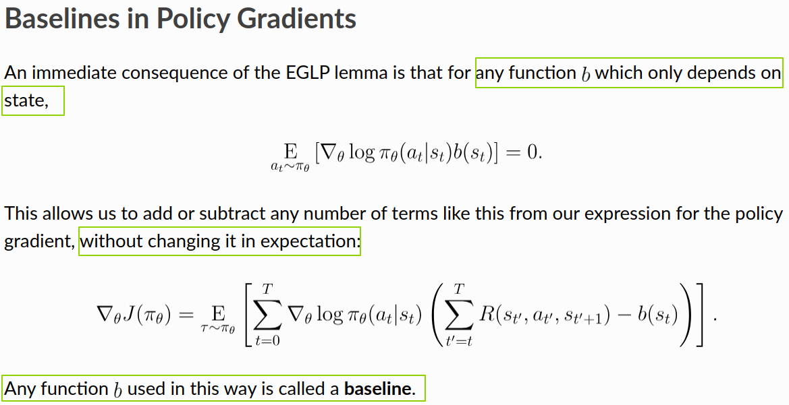
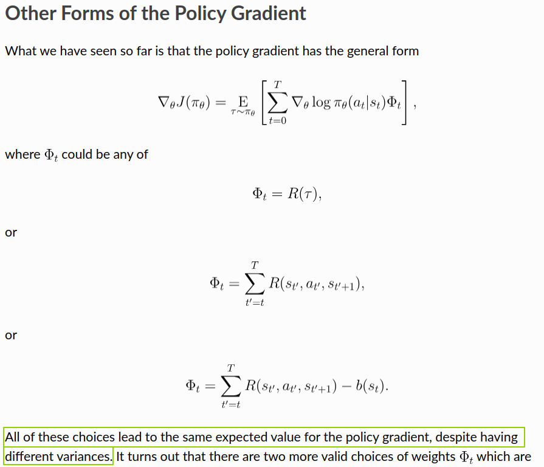

## A Discussion of Baselines

Here I want to spend a bit more time on the idea of a baseline. The main reference is OpenAI’s [Intro to Policy Optimization](https://spinningup.openai.com/en/latest/spinningup/rl_intro3.html).

In policy gradient, PPO, and GRPO, the notion of a baseline appears repeatedly. A baseline is a function. It depends on the current state, but not on the action taken.

Its role is to reduce the variance of the gradient estimator, which makes optimization more stable, even though it does not necessarily make the estimator more accurate.

As explained above, we can write the core form of policy gradient as

$$
\nabla_\theta \log \pi_\theta \cdot \text{reward}
$$ {#eq-policy-gradient-reward}

So why are we allowed to add a baseline?

The core reason is the EGLP lemma. Under this form, the expectation of the term involving the baseline is zero, so adding or subtracting it does not change the expected value of the gradient.

{fig-align="center" width="70%"}

## The Physics of Baselines

Being allowed to introduce a baseline is the mathematical part. But why we want to introduce one, and what kind of baseline works well in practice, is more of the “physics” part.

Let us first try to answer the first question: why introduce a baseline?

- In one state, the environment may naturally give high rewards regardless of how good the policy is. In that case, if we sample from the policy, the resulting rewards might look like 505, 506, 507, 508 — all large numbers.
- In another state, the environment may require a much better policy before it gives relatively high rewards. In that case, rewards sampled from the policy might look like 5, 6, 7, 8 — much smaller numbers.

As a result, during RL training, the gradient estimates can have very different scales across different states. If we introduce a baseline, we can subtract out the “natural” reward level of each state and focus only on the part that comes from the policy itself.

The figure below shows the core form of policy gradient and two ways of incorporating reward model scores:

1. direct use:
   $$
   \nabla_\theta \log \pi_\theta \cdot \text{reward}
   $$ {#eq-direct-reward-form}

2. subtracting a baseline:
   $$
   \nabla_\theta \log \pi_\theta \cdot (\text{reward} - \text{baseline})
   $$ {#eq-baseline-subtracted-form}

{fig-align="center" width="70%"}

As shown above, all forms can provide reasonably accurate, roughly unbiased gradient estimates, but they have different variances. Statistically, we want the variance to be as small as possible without sacrificing too much accuracy, because that usually leads to better sample efficiency, better optimization efficiency, and more stable training.

In the [GAE paper](https://arxiv.org/abs/1506.02438), John Schulman also cites [Variance Reduction Techniques for Gradient Estimates in Reinforcement Learning](https://link.springer.com/article/10.1023/A:1022672621406) as a reference on how baselines help reduce variance.

Next comes the second question: what kind of baseline works well?

A practical way to approach this question is to look at what current methods actually use. Whether it is PPO, GRPO, or K1.5, they all choose something related to an expected value or an empirical mean.

- In PPO, the baseline is the output of the value function shown below. It estimates the average future return:

> “The most common choice of baseline is the on-policy value function $V^\pi(s_t)$. Recall that this is the average return an agent gets if it starts in state $s_t$ and then acts according to policy $\pi$ for the rest of its life.”

- In GRPO, the baseline is the mean reward over $G$ samples generated for the **same** question:

> “To address this, as shown in Figure 4, we propose Group Relative Policy Optimization (GRPO), which obviates the need for additional value function approximation as in PPO, and instead uses the average reward of multiple sampled outputs, produced in response to the same question, as the baseline.”

- In K1.5, the quantity playing a baseline-like role is $\tau \log Z$. As shown by the earlier derivation and also supported by the authors’ practical findings, it can be approximated by $\bar r$, the empirical mean of reward-model scores over $k$ samples for the **same** question:

> “To approximate $\tau \log Z$, we use samples $(y_1, z_1), \ldots, (y_k, z_k) \sim \pi_{\theta_i}$: $\tau \log Z \approx \tau \log \frac{1}{k} \sum_{j=1}^{k} \exp(r(x, y_j, y^*) / \tau).$ We also find that using empirical mean of sampled rewards $\bar r = \mathrm{mean}(r(x, y_1, y^*), \ldots, r(x, y_k, y^*))$ yields effective practical results. This is reasonable since $\tau \log Z$ approaches the expected reward under $\pi_{\theta_i}$ as $\tau \to \infty$.”

This choice is also quite intuitive. It is similar to centering a batch of data before optimization: first subtract the mean so that the values are distributed around zero, which usually gives better optimization behavior.
