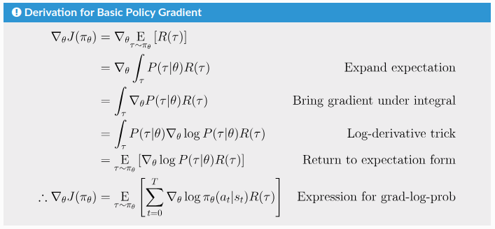
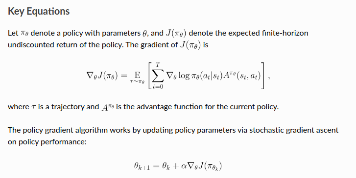
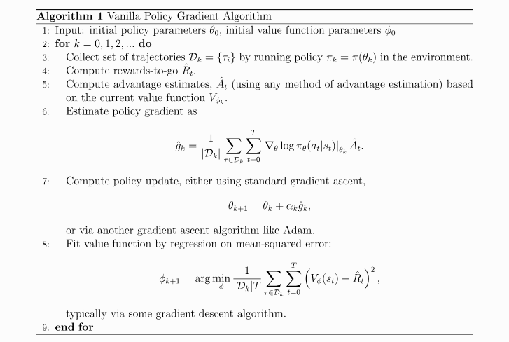

::: {.callout-tip appearance="simple"}
**Main references**:

1. **RL Basics**: [Spinning Up Part 1: Key Concepts in RL](https://spinningup.openai.com/en/latest/spinningup/rl_intro.html)
2. **Policy Gradient Theory Basics**: [Spinning Up Part 3: Intro to Policy Optimization](https://spinningup.openai.com/en/latest/spinningup/rl_intro3.html)
3. **Basic Version of Policy Gradient**: [Spinning Up - Vanilla Policy Gradient](https://spinningup.openai.com/en/latest/algorithms/vpg.html)
4. **PPO**: [Spinning Up - Proximal Policy Optimization](https://spinningup.openai.com/en/latest/algorithms/ppo.html)
   a. **Schulman’s PPO paper**: [PPO Algorithm](https://arxiv.org/abs/1707.06347)
   b. **GAE**: [High-Dimensional Continuous Control Using Generalized Advantage Estimation](https://arxiv.org/abs/1506.02438)
5. **GRPO**:
   a. **DeepSeekMath**: [DeepSeekMath: Pushing the Limits of Mathematical Reasoning in Open Language Models](https://arxiv.org/abs/2402.03300)
   b. **DeepSeek-R1**: [DeepSeek-R1: Incentivizing Reasoning Capability in LLMs via Reinforcement Learning](https://arxiv.org/abs/2501.12948)
:::

## The RL Objective in the World of Large Language Models

::: {.callout-tip appearance="simple"}
👉 The RL objective in the general RL world and in the world of large language models is essentially the same, though the expression is slightly different. Understanding this makes it easier to read articles from different RL settings. In particular:

- Articles from the general reinforcement learning world: `policy gradient`, `PPO`
- Articles from the large language model world: `DeepSeek R1`, `Kimi K1.5 technical report`
:::

In the general reinforcement learning setting, the algorithm optimizes the following objective:

$$
J(\pi_\theta) = \mathbb{E}_{\tau \sim \pi_\theta}[R(\tau)]
= \mathbb{E}_{\tau \sim \pi_\theta}\left[\sum_{t=0}^{T} r_t\right]
= \mathbb{E}_{\tau \sim \pi_\theta}\left[\sum_{t=0}^{T} r(s_t, a_t, s_{t+1})\right]
$$

Here:

- $\tau$ denotes a trajectory of `<state, action>`
- $R(\tau)$ denotes the return, i.e. the cumulative reward, the sum of future rewards
- $r_t = r(s_t, a_t, s_{t+1})$ denotes the reward function

However, in the world of large language models, the expression above can be updated and refined. The core reason is that the reward model does not provide a reliable and meaningful reward at every action step. We usually do not care about RM scores for intermediate results; we only care about the reward model's score for the complete answer.

Therefore,

$$
r(s_t, a_t, s_{t+1}) = 0 \quad \text{for } t < T
$$

$$
J(\pi_\theta) = \mathbb{E}_{\tau \sim \pi_\theta}\left[\sum_{t=0}^{T} r(s_t, a_t, s_{t+1})\right]
= \mathbb{E}_{\tau \sim \pi_\theta}[r(s_T, a_T, s_{T+1})]
$$

At the same time, if we let $q$ denote the instruction (or question) seen by the model, and $o$ denote the answer generated by the model, then $o$ can be viewed as the trajectory $\tau$ chosen by model $\pi_\theta$:

$$
J(\pi_\theta) = \mathbb{E}_{q, o \sim \pi_\theta}[r(q, o)]
$$

Here, $r(q, o)$ denotes the score assigned by the reward model after seeing the user input and the model output.

The expectation in the expression above means: after optimization, for each question $q$, the answer $o$ produced by model $\pi_\theta$ is likely to receive a higher reward from the reward model.

## 1. Policy Gradient

Policy gradient is an algorithm from the standard RL world. We first describe the problem and the solution using the language of general reinforcement learning, and define the objective function:

$$
J(\pi_\theta) = \mathbb{E}_{\tau \sim \pi_\theta}[R(\tau)]
$$

The core derivation of its gradient is shown below:

{fig-align="center" width="70%" fig-cap="Derivation for Basic Policy Gradient"}

The gradient obtained above can be viewed as a weighted average of $\nabla_\theta \log \pi_\theta$:

$$
\nabla_\theta \log \pi_\theta \cdot \text{weight}
$$

Once we have the gradient, we basically arrive at a trainable and optimizable starting point. However, practice shows that training may be unstable, convergence may be slow, and performance may be suboptimal. Therefore, people introduced the concept of a **baseline** to improve stability and training efficiency. (For example, see the discussion of baselines in the mathematical proof section of the `Kimi K1.5` technical report.)

In the policy gradient family of methods, the baseline is a function whose output has the same scale as the reward. It is used to subtract from the reward and adjust the weight on $\nabla_\theta \log \pi_\theta$. After introducing the baseline, we obtain the core expression used in policy gradient methods:

$$
\nabla_\theta \log \pi_\theta \cdot (r - \text{baseline})
$$

Under this formulation, the most common choice of weight is the **advantage function**, defined as:

$$
A^{\pi}(s, a) = Q^{\pi}(s, a) - V^{\pi}(s)
$$

So the corresponding core gradient expression becomes:

$$
\nabla_\theta \log \pi_\theta \cdot A^{\pi}
$$

Once we have this core gradient estimation form, vanilla policy gradient is essentially established:

{fig-align="center" width="70%" fig-cap="Key Equations for Vanilla Policy Gradient"}

{fig-align="center" width="70%" fig-cap="Vanilla Policy Gradient"}

Up to this point, we have discussed the first column of the table below: **policy gradient**.

::: {.table-scroll-small}
|  | **Policy Gradient** | **PPO** | **GRPO** | **Kimi K1.5** |
|---|---|---|---|---|
| **policy model** $\pi_\theta$ | Required. This is the model being optimized. | Required. This is the model being optimized. | Required. This is the model being optimized. | Required. This is the model being optimized. |
| **reference policy model** $\pi_{\theta_k}$ | Not required. | Required. | Required. | Required. |
| **reward model** | Required. | Required. | Required. | Required. |
| **value function** $V_{\phi_k}$ (**critic model**) | Required. It estimates the expected future return, and methods such as GAE use it to compute the advantage. It must be continuously updated and kept accurate. | Required. It estimates the expected future return, and methods such as GAE use it to compute the advantage. It must be continuously updated and kept accurate. | Not required, because the computation of the advantage avoids this path. | Not required. Since the gradient can be written explicitly, the baseline-like term can be approximated by the sample mean. |
| **rewards-to-go** $\hat{R}_t$ | Required, for updating the value function. | Required, for updating the value function. Exactly how the reward is distributed back to each token depends on the implementation. | Not needed, since there is no critic. | Not needed, since there is no critic. |
:::
