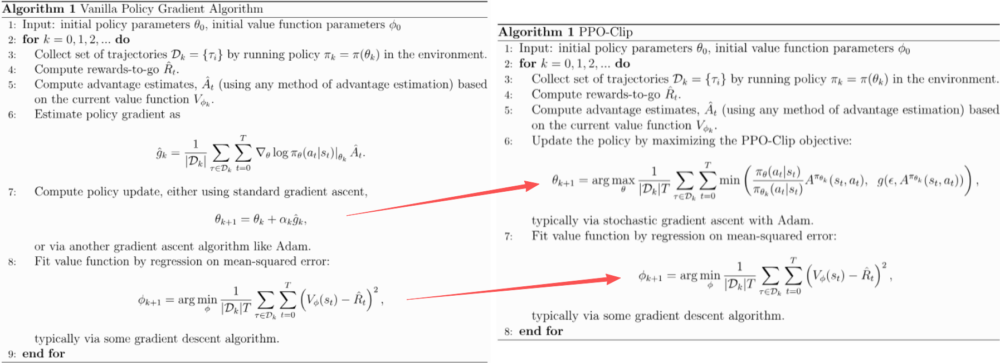
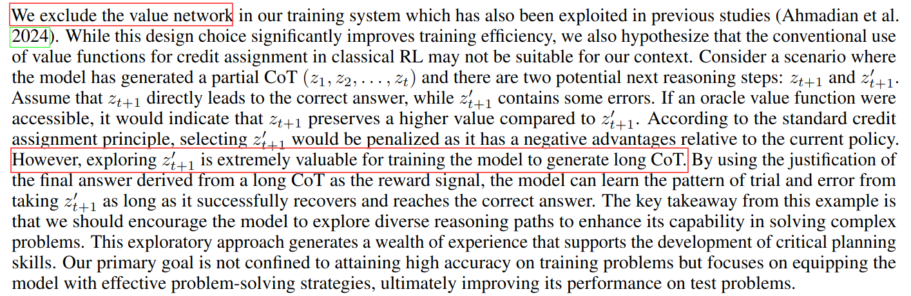

## The RL Objective in the World of Large Language Models

::: {.callout-tip appearance="simple"}
The RL objective in the general RL world and in the world of large language models is essentially the same, though the expression is slightly different. Understanding this makes it easier to read articles from different RL settings. In particular:

- Articles from the general reinforcement learning world: `policy gradient`, `PPO`
- Articles from the large language model world: `DeepSeek R1`, `Kimi K1.5 technical report`
:::

In the general reinforcement learning setting, the algorithm optimizes the following objective:

$$
J(\pi_\theta) = \mathbb{E}_{\tau \sim \pi_\theta}[R(\tau)]
= \mathbb{E}_{\tau \sim \pi_\theta}\left[\sum_{t=0}^{T} r_t\right]
= \mathbb{E}_{\tau \sim \pi_\theta}\left[\sum_{t=0}^{T} r(s_t, a_t, s_{t+1})\right]
$$

Here:

- $\tau$ denotes a trajectory of `<state, action>`
- $R(\tau)$ denotes the return, i.e. the cumulative reward, the sum of future rewards
- $r_t = r(s_t, a_t, s_{t+1})$ denotes the reward function

However, in the world of large language models, the expression above can be updated and refined. The core reason is that the reward model does not provide a reliable and meaningful reward at every action step. We usually do not care about RM scores for intermediate results; we only care about the reward model's score for the complete answer.

Therefore,

$$
r(s_t, a_t, s_{t+1}) = 0 \quad \text{for } t < T
$$

$$
J(\pi_\theta) = \mathbb{E}_{\tau \sim \pi_\theta}\left[\sum_{t=0}^{T} r(s_t, a_t, s_{t+1})\right]
= \mathbb{E}_{\tau \sim \pi_\theta}[r(s_T, a_T, s_{T+1})]
$$

At the same time, if we let $q$ denote the instruction (or question) seen by the model, and $o$ denote the answer generated by the model, then $o$ can be viewed as the trajectory $\tau$ chosen by model $\pi_\theta$:

$$
J(\pi_\theta) = \mathbb{E}_{q, o \sim \pi_\theta}[r(q, o)]
$$

Here, $r(q, o)$ denotes the score assigned by the reward model after seeing the user input and the model output.

The expectation in the expression above means: after optimization, for each question $q$, the answer $o$ produced by model $\pi_\theta$ is likely to receive a higher reward from the reward model.

## 1. Policy Gradient

Policy gradient is an algorithm from the standard RL world. We first describe the problem and the solution using the language of general reinforcement learning, and define the objective function:

$$
J(\pi_\theta) = \mathbb{E}_{\tau \sim \pi_\theta}[R(\tau)]
$$

The core derivation of its gradient is shown below:

{fig-align="center" width="60%" fig-cap="Derivation for Basic Policy Gradient"}

The gradient obtained above can be viewed as a weighted average of $\nabla_\theta \log \pi_\theta$:

$$
\nabla_\theta \log \pi_\theta \cdot \text{weight}
$$

Once we have the gradient, we basically arrive at a trainable and optimizable starting point. However, practice shows that training may be unstable, convergence may be slow, and performance may be suboptimal. Therefore, people introduced the concept of a baseline to improve stability and training efficiency. (For example, see the discussion of baselines in the mathematical proof section of the `Kimi K1.5` technical report.)

In the policy gradient family of methods, the baseline is a function whose output has the same scale as the reward. It is used to subtract from the reward and adjust the weight on $\nabla_\theta \log \pi_\theta$. After introducing the baseline, we obtain the core expression used in policy gradient methods:

$$
\nabla_\theta \log \pi_\theta \cdot (r - \text{baseline})
$$

Under this formulation, the most common choice of weight is the advantage function, defined as:

$$
A^{\pi}(s, a) = Q^{\pi}(s, a) - V^{\pi}(s)
$$

So the corresponding core gradient expression becomes:

$$
\nabla_\theta \log \pi_\theta \cdot A^{\pi}
$$

Once we have this core gradient estimation form, vanilla policy gradient is essentially established:

{fig-align="center" width="70%" fig-cap="Key Equations for Vanilla Policy Gradient"}

{fig-align="center" width="70%" fig-cap="Vanilla Policy Gradient"}

Up to this point, we have discussed the first column of the table below: policy gradient.

::: {.table-scroll-small}
|  | **Policy Gradient** | **PPO** | **GRPO** | **Kimi K1.5** |
|---|---|---|---|---|
| **policy model** $\pi_\theta$ | Required. This is the model being optimized. | Required. This is the model being optimized. | Required. This is the model being optimized. | Required. This is the model being optimized. |
| **reference policy model** $\pi_{\theta_k}$ | Not required. | Required. | Required. | Required. |
| **reward model** | Required. | Required. | Required. | Required. |
| **value function** $V_{\phi_k}$ (**critic model**) | Required. It estimates the expected future return, and methods such as GAE use it to compute the advantage. It must be continuously updated and kept accurate. | Required. It estimates the expected future return, and methods such as GAE use it to compute the advantage. It must be continuously updated and kept accurate. | Not required, because the computation of the advantage avoids this path. | Not required. Since the gradient can be written explicitly, the baseline-like term can be approximated by the sample mean. |
| **rewards-to-go** $\hat{R}_t$ | Required, for updating the value function. | Required, for updating the value function. Exactly how the reward is distributed back to each token depends on the implementation. | Not needed, since there is no critic. | Not needed, since there is no critic. |
:::

## 2. PPO

The PPO algorithm was proposed by Schulman ([paper](https://arxiv.org/abs/1707.06347)). It builds on ideas from policy gradient and trust region methods (TRPO).

As shown below, from the perspective of overall algorithmic structure, they are quite similar: both require a value function. The key difference lies in how the parameter $\theta$ is updated. PPO introduces a new objective function, which leads to improvements in stability, convergence speed, performance, and ease of implementation.

{fig-align="center" width="99%" fig-cap="Vanilla Policy Gradient vs. PPO-Clip"}

Unlike policy gradient, PPO does not directly solve the problem starting from the original objective:

$$
J(\pi_\theta) = \mathbb{E}_{\tau \sim \pi_\theta}[R(\tau)]
$$

Instead, PPO uses a new objective, usually called the surrogate objective function. Its core term is:

$$
L_{\text{core}}(\theta) = \mathbb{E}_t \left[
\frac{\pi_\theta(a_t \mid s_t)}{\pi_{\theta_{\text{old}}}(a_t \mid s_t)} A_t
\right]
$$

The intuition is simple:

- If action $a_t$ has positive advantage, then the new policy $\pi_\theta$ should assign a higher probability to this action in the future.
- If action $a_t$ has negative advantage, then the new policy should assign a lower probability to this action in the future.

GAE is a common method for estimating the advantage.

PPO's objective does not stop here. It also adds a clipping term:

$$
\operatorname{clip}\left(
\frac{\pi_\theta(a_t \mid s_t)}{\pi_{\theta_{\text{old}}}(a_t \mid s_t)},
1 - \epsilon,\ 1 + \epsilon
\right) A_t
$$

The idea is to prevent the model from changing too much in a single update, so that training does not become overly aggressive.

However, in practice, this operation mainly constrains the positive-advantage case. The reason is that the new objective includes one more step:

$$
\min\left(
\frac{\pi_\theta(a_t \mid s_t)}{\pi_{\theta_{\text{old}}}(a_t \mid s_t)} A_t,\ 
\operatorname{clip}(\cdot) A_t
\right)
$$

At first glance, clipping seems to constrain both positive and negative returns. But after taking the minimum, the negative-advantage, unclipped term is still exposed to the optimizer.

The full PPO objective is therefore:

$$
L(\theta)=\mathbb{E}_t\left[
\min\left(
\frac{\pi_\theta(a_t \mid s_t)}{\pi_{\theta_{\text{old}}}(a_t \mid s_t)} A_t,\ 
\operatorname{clip}\left(
\frac{\pi_\theta(a_t \mid s_t)}{\pi_{\theta_{\text{old}}}(a_t \mid s_t)},
1-\epsilon,\,1+\epsilon
\right)A_t
\right)
\right]
$$

This new objective does not have a closed-form solution, so it is optimized through stochastic gradient ascent.

So far, we have discussed the second column of the table below: PPO.

::: {.table-scroll-small}
|  | **Policy Gradient** | **PPO** | **GRPO** | **Kimi K1.5** |
|---|---|---|---|---|
| **policy model** $\pi_\theta$ | Required. This is the model being optimized. | Required. This is the model being optimized. | Required. This is the model being optimized. | Required. This is the model being optimized. |
| **reference policy model** $\pi_{\theta_k}$ | Not required. | Required. | Required. | Required. |
| **reward model** | Required. | Required. | Required. | Required. |
| **value function** $V_{\phi_k}$ (**critic model**) | Required. It estimates the expected future return, and methods such as GAE use it to compute the advantage. It must be continuously updated and kept accurate. | Required. It estimates the expected future return, and methods such as GAE use it to compute the advantage. It must be continuously updated and kept accurate. | Not required, because the computation of the advantage avoids this path. | Not required. Since the gradient can be written explicitly, the baseline-like term can be approximated by the sample mean. |
| **rewards-to-go** $\hat{R}_t$ | Required, for updating the value function. | Required, for updating the value function. Exactly how the reward is distributed back to each token depends on the implementation. | Not needed, since there is no critic. | Not needed, since there is no critic. |
:::

## 3. GRPO

GRPO is very similar to PPO. To better see the difference, we first need to understand one detail in the mathematical expression. The mathematics in the GRPO paper is written in the style of the LLM setting. The core idea is that it no longer focuses on the ratios or advantages associated with intermediate steps $t < T$, and only cares about the final step $t = T$. As a result, in the objective, the expectation over $t$ in the form $\mathbb{E}_t[\cdots]$ no longer appears.

Next comes the key extension in GRPO: it introduces repeated sampling for the same prompt $q$. For a given prompt $q$, the model performs multiple rollouts and obtains a group of outputs $\{o_1, o_2, \ldots, o_G\}$. GRPO then uses this group of outputs to define the advantage and the optimization direction. This is the main innovation of GRPO.

More specifically, given a prompt $q$, GRPO samples a group of outputs $\{o_1, o_2, \ldots, o_G\}$ from the reference policy $\pi_{\theta_{\text{old}}}$. The new policy is then optimized so that, within this group, outputs with above-average advantage are encouraged. Ignoring the KL term, the objective can be written as:

$$
L(\theta)=\mathbb{E}_{q}\left[
\min\left(
\frac{\pi_\theta(o \mid q)}{\pi_{\theta_{\text{old}}}(o \mid q)}A_o,\ 
\operatorname{clip}\left(
\frac{\pi_\theta(o \mid q)}{\pi_{\theta_{\text{old}}}(o \mid q)},\,1-\epsilon,\,1+\epsilon
\right)A_o
\right)
\right]
$$

The structure of this objective is the same as PPO. In practice, the expectation above is implemented as an average over the $G$ sampled outputs:

$$
L(\theta)=\frac{1}{G}\sum_{i=1}^{G}\left[
\min\left(
\frac{\pi_\theta(o_i \mid q)}{\pi_{\theta_{\text{old}}}(o_i \mid q)}\hat{A}_i,\ 
\operatorname{clip}\left(
\frac{\pi_\theta(o_i \mid q)}{\pi_{\theta_{\text{old}}}(o_i \mid q)},\,1-\epsilon,\,1+\epsilon
\right)\hat{A}_i
\right)
\right]
$$

Unlike PPO, the advantage here is not estimated with GAE. Instead, it is computed by normalizing the rewards $\{r_i(q_i, o)\}$ within the group:

$$
\hat{A}_i=\frac{r_i-\bar{r}}{\operatorname{std}(\{r_1,\ldots,r_G\})}
$$

Under this design, there is no longer a need for a critic model or for GAE-based advantage estimation. This reduces computation cost and also avoids relying on a separately trained critic model whose estimates may be inaccurate, thereby reducing one source of instability.

So far, we have discussed the third column of the table below: GRPO.

::: {.table-scroll-small}
|  | **Policy Gradient** | **PPO** | **GRPO** | **Kimi K1.5** |
|---|---|---|---|---|
| **policy model** $\pi_\theta$ | Required. This is the model being optimized. | Required. This is the model being optimized. | Required. This is the model being optimized. | Required. This is the model being optimized. |
| **reference policy model** $\pi_{\theta_k}$ | Not required. | Required. | Required. | Required. |
| **reward model** | Required. | Required. | Required. | Required. |
| **value function** $V_{\phi_k}$ (**critic model**) | Required. It estimates the expected future return, and methods such as GAE use it to compute the advantage. It must be continuously updated and kept accurate. | Required. It estimates the expected future return, and methods such as GAE use it to compute the advantage. It must be continuously updated and kept accurate. | Not required, because the computation of the advantage avoids this path. | Not required. Since the gradient can be written explicitly, the baseline-like term can be approximated by the sample mean. |
| **rewards-to-go** $\hat{R}_t$ | Required, for updating the value function. | Required, for updating the value function. Exactly how the reward is distributed back to each token depends on the implementation. | Not needed, since there is no critic. | Not needed, since there is no critic. |
:::

## Why a Critic Can Suppress Reflective CoT (long CoT)

DeepSeek-style methods and Kimi K1.5 both remove the critic, that is, the value function. The explanation below is adapted from the Kimi K1.5 technical report.

{fig-align="center" width="90%" fig-cap="No critic in DeepSeek R1 and Kimi K1.5"}

Beyond higher training efficiency and lower computational cost, the core reason is the following: people found that reflective CoT, or long CoT, matters. Allowing the model to explore reasoning paths in CoT that may look “actually wrong” can still be meaningful for improving reasoning ability. However, an ideal value function may do exactly the opposite: it can react very sensitively to these seemingly wrong attempts made by the policy, and penalize them too early.

::: {.callout-tip appearance="simple"}
**Main references**:

1. **RL Basics**: [Spinning Up Part 1: Key Concepts in RL](https://spinningup.openai.com/en/latest/spinningup/rl_intro.html)
2. **Policy Gradient Theory Basics**: [Spinning Up Part 3: Intro to Policy Optimization](https://spinningup.openai.com/en/latest/spinningup/rl_intro3.html)
3. **Basic Version of Policy Gradient**: [Spinning Up - Vanilla Policy Gradient](https://spinningup.openai.com/en/latest/algorithms/vpg.html)
4. **PPO**: [Spinning Up - Proximal Policy Optimization](https://spinningup.openai.com/en/latest/algorithms/ppo.html)
   a. **Schulman’s PPO paper**: [PPO Algorithm](https://arxiv.org/abs/1707.06347)
   b. **GAE**: [High-Dimensional Continuous Control Using Generalized Advantage Estimation](https://arxiv.org/abs/1506.02438)
5. **GRPO**:
   a. **DeepSeekMath**: [DeepSeekMath: Pushing the Limits of Mathematical Reasoning in Open Language Models](https://arxiv.org/abs/2402.03300)
   b. **DeepSeek-R1**: [DeepSeek-R1: Incentivizing Reasoning Capability in LLMs via Reinforcement Learning](https://arxiv.org/abs/2501.12948)
:::