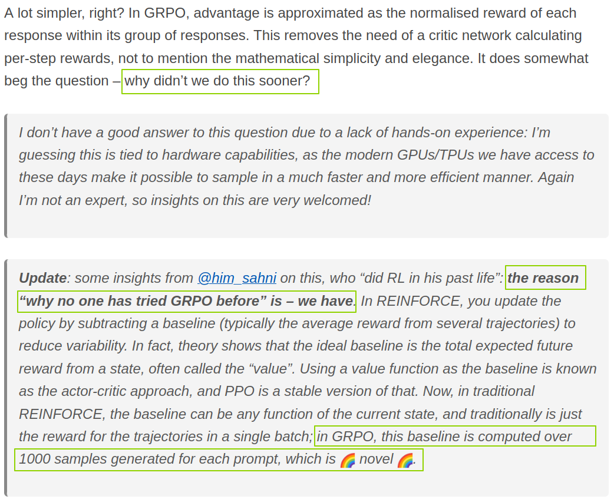

::: {.callout-tip appearance="simple"}
**Suggested reading order**:

1. [RL: DeepSeek R1 vs Kimi K1.5](https://tail-3lbs.github.io/TechNotes/notes/rl-r1-vs-k1.5/)
1. [Policy Gradient, PPO, GRPO](https://tail-3lbs.github.io/TechNotes/notes/policy-gradient-ppo-grpo/)
1. [Kimi K1.5 Technical Report](https://tail-3lbs.github.io/TechNotes/notes/kimi-k1.5-report/)
1. [LLM RL Baseline](https://tail-3lbs.github.io/TechNotes/notes/llm-rl-baseline/)
:::

## Summary

In my view, these methods are different in form but similar in spirit. The RL optimization parts of K1.5 and R1 can still be understood within the broader framework of policy gradient.

First, GRPO can be placed under the policy gradient framework, because PPO itself belongs there, and the main difference between GRPO and PPO lies in how the advantage is computed.

As for K1.5, if we break it down, it still contains pieces such as a surrogate objective function, an advantage-like term, and a gradient-based update. These are all central ingredients of the policy gradient family. Although the K1.5 authors describe their method as originating from policy mirror descent, in actual optimization it is still updated through gradients. So I think it is reasonable to understand it together with policy gradient methods under a broader common framework.

## Multiple Samples for the Same Question

At the same time, notice that K1.5 and GRPO both include the operation of sampling multiple outputs for the same prompt. These samples are then used to compute quantities such as the advantage or the baseline, which avoids using and maintaining a critic model, that is, a value function. This is something PPO did not have in its earlier form.

The figure below explains why GRPO is considered an innovation. In one sentence: the baseline in GRPO is obtained by sampling multiple times for the same question.

<figure style="text-align: center; margin: 1.5rem 0;">
  
  <figcaption>
    Source:
    <a href="https://yugeten.github.io/posts/2025/01/ppogrpo/" target="_blank">
      A vision researcher’s guide to some RL stuff: PPO &amp; GRPO
    </a>
  </figcaption>
</figure>

## From the Perspective of Its Components

::: {.table-scroll-small}
|  | **Policy Gradient** | **PPO** | **GRPO** | **Kimi K1.5** |
|---|---|---|---|---|
| **policy model** $\pi_\theta$ | Required. This is the model being optimized. | Required. This is the model being optimized. | Required. This is the model being optimized. | Required. This is the model being optimized. |
| **reference policy model** $\pi_{\theta_k}$ | Not required. | Required. | Required. | Required. |
| **reward model** | Required. | Required. | Required. | Required. |
| **value function** $V_{\phi_k}$ (**critic model**) | Required. It estimates the expected future return, and methods such as GAE use it to compute the advantage. It must be continuously updated and kept accurate. | Required. It estimates the expected future return, and methods such as GAE use it to compute the advantage. It must be continuously updated and kept accurate. | Not required, because the computation of the advantage avoids this path. | Not required. Since the gradient can be written explicitly, the baseline-like term can be approximated by the sample mean. |
| **rewards-to-go** $\hat{R}_t$ | Required, for updating the value function. | Required, for updating the value function. Exactly how the reward is distributed back to each token depends on the implementation. | Not needed, since there is no critic. | Not needed, since there is no critic. |
:::

## From the Perspective of the Key Computations

::: {.table-scroll-small}
|  | **Policy Gradient** |
|---|---|
| **objective function** | $J(\pi_\theta)=\mathbb{E}_{\tau\sim\pi_\theta}[R(\tau)]$ |
| **surrogate objective function** | None |
| **gradient** | $\nabla_\theta \log \pi_\theta \cdot A^{\pi_\theta}$ |
| **advantage** | $A^{\pi_\theta}(s,a)=Q^{\pi_\theta}(s,a)-V^{\pi_\theta}(s)$ |
:::

::: {.table-scroll-small}
|  | **PPO** |
|---|---|
| **objective function** | $J(\pi_\theta)=\mathbb{E}_{\tau\sim\pi_\theta}[R(\tau)]$ |
| **surrogate objective function** | $$L(\theta)=\mathbb{E}_t\left[\min\left(\frac{\pi_\theta(a_t\mid s_t)}{\pi_{\theta_{\mathrm{old}}}(a_t\mid s_t)}A_t,\ \operatorname{clip}\left(\frac{\pi_\theta(a_t\mid s_t)}{\pi_{\theta_{\mathrm{old}}}(a_t\mid s_t)},1-\epsilon,1+\epsilon\right)A_t\right)\right]$$ |
| **gradient** | No closed-form expression; computed numerically |
| **advantage** | $A^\pi(s,a)=Q^\pi(s,a)-V^\pi(s)$  \  (typically estimated with GAE) |
:::

::: {.table-scroll-small}
|  | **GRPO** |
|---|---|
| **objective function** | $J(\pi_\theta)=\mathbb{E}_{\tau\sim\pi_\theta}[R(\tau)]$ |
| **surrogate objective function** | $$L(\theta)=\mathbb{E}_{o}\left[\min\left(\frac{\pi_\theta(o\mid q)}{\pi_{\theta_{\mathrm{old}}}(o\mid q)}A_o,\ \operatorname{clip}\left(\frac{\pi_\theta(o\mid q)}{\pi_{\theta_{\mathrm{old}}}(o\mid q)},1-\epsilon,1+\epsilon\right)A_o\right)\right]$$ \ (ignoring the KL term) |
| **gradient** | No closed-form expression; computed numerically |
| **advantage** | $$\hat A_i=\frac{r_i-\bar r}{\operatorname{std}(\{r_1,\ldots,r_G\})}$$ \ (multiple samples for the same question; no critic model; no GAE) |
:::

::: {.table-scroll-small}
|  | **Kimi K1.5** |
|---|---|
| **objective function** | $$\max_\theta\ \mathbb{E}_{(y,z)\sim\pi_\theta}[r(x,y,y^*)]-\tau\,\mathrm{KL}\big(\pi_\theta(x)\,\|\,\pi_{\theta_i}(x)\big)$$ |
| **surrogate objective function** | $$L(\theta)=\mathbb{E}_{(x,y^*)\sim\mathcal D}\left[\mathbb{E}_{(y,z)\sim\pi_{\theta_i}}\left[\left(r(x,y,y^*)-\tau\log Z-\tau\log\frac{\pi_\theta(y,z\mid x)}{\pi_{\theta_i}(y,z\mid x)}\right)^2\right]\right]$$ |
| **gradient** | $$\frac{1}{k}\sum_{j=1}^{k}\left[(r(x,y_j,y^*)-\bar r)\cdot\nabla_\theta\log\pi_\theta(y_j,z_j\mid x)-\frac{\tau}{2}\nabla_\theta\left(\log\frac{\pi_\theta(y_j,z_j\mid x)}{\pi_{\theta_i}(y_j,z_j\mid x)}\right)^2\right]$$ |
| **advantage** | $r-\bar r$  \  (multiple samples for the same question; no critic model; no GAE) |
:::